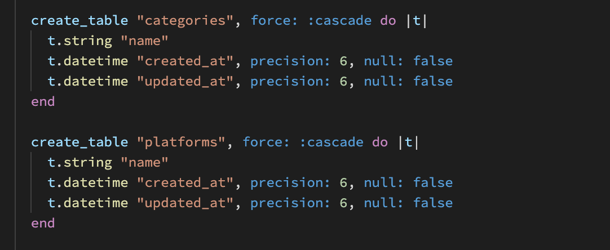

<!-- README documentation Requirement-->
## Marketplace Project (T2A2)

<!-- R9	A link (URL) to your deployed app (i.e. website) -->
Link to website : [Tiny Game Store -- Heroku](https://tiny-game-store.herokuapp.com/)
<!-- - R10	A link to your GitHub repository (repo).
  - Ensure the repo is accessible by your Educators -->
Link to repository : [Github Repository](https://github.com/sam-lee-py/T2A2_APP)

<!-- - R20	Describe the way tasks are allocated and tracked in your project  -->
Master key: [master key](./doc/master.key)

<!--  - R7	Identification of the problem you are trying to solve by building this particular marketplace app.
      - R8	Why is it a problem that needs solving? 
      - R11	Description of your marketplace app (website), including:
        - Purpose
  -->

### Purpose and problem to solve
Tiny-game-store provide a two sided online marketpalce for users to sell their games for other uses and to help users find some old games they might be interested in.
Tiny-game-store tries to solve the following problems for game lovers.
1. There is never enough game to play. New games are released every year, and if you buy every new game, it's going to be a lot of money.
2. There are many games that have been idle for a long time
3. Some old games are hard to find in the market.

<!-- - R12	User stories for your app -->
### User story
As a user, I need a place to show my games and explore them to other users.
I need an account and password. Sign up and Log in to the website.
I want to create a new game by use list so i can quickly create the new games.
I want to edit the existing games to current the information or change the price.
I want list all my games that on the market.
As a buyer, I need to search the games make it faster.
I need the ditials of the games.
I need the place to pay, and i need to get the recipet.
I need a place to store the purchased games i bought before.
I need a cart so i can pay them together.

<!-- R11 - Target audience -->
### Target Audience
The Tiny game store is target the people have idle game to sells and the ppl want find cheap games to play or the old games taht hard to find now.

<!-- R11  - Functionality / features -->
### Features
The Features for this website are:
1. Account management.User could login and log out their account. New user could sign up by their email address.
2. Goods edit and delete by their creater only, any account could be a seller and buyer, they can only buy the goods that not create by themself.
3. Search bar for the user to faster get the good they want.

<!-- R11 - Tech stack (e.g. html, css, deployment platform, etc) -->
### Tech stack
- Frontend:
  - HTML
  - CSS
  - SCSS
  - Bootstrap

- Backend:
  - Ruby - v2.7.5p203
  - Rails - v6.1.4.6
  - NodeJS - v17.3.1

- Database:
  - PostgreSQL

- Development:
  - Heroku
  - Ultralhook
  - Respec
  - factory_bot

- Cloud:
  - Amazon S3  (image storage)

<!-- R11 - Sitemap -->
### Site map

<!-- - R13	Wireframes for your app -->
### Wireframes
All games page

Show game page

Suess payment page

My games list page

My purchased list page

<!-- R11   - Screenshots -->
### Screenshort

All games page

Show game page

Create game page

My games list page

My purchased list page

<!-- - R14	An ERD for your app -->
### ERD

<!-- - R15	Explain the different high-level components (abstractions) in your app -->
### Components
The Tiny-game-store is build by Ruby on rails framwork, with MVC design pattern.
Use controller to control the Medol and Views and make app working.

<!-- - R17	Describe your projects models in terms of the relationships (active record associations) they have with each other
- R18	Discuss the database relations to be implemented in your application
- R19	Provide your database schema design -->
#### User

I use devise to create the user. The user table is only for users to create accounts. Because each user can be a seller and a buyer, in the order table, seller_id and buyer_id are both foreign_key links to user_id. For the Game table, there is only 1 user_id representing the game's creation id.

#### Game

Game table store all the games that user created.
User_id for the seller id link to the user table. By use the Game.user_id we could get all the games that create by this user and check if the user is current user(give the authority to edit and delete the game). 
Category_id and Platform_id is link to the category table and Platform table. Cos each game only have 1 category and 1 platform so we dont need join table between.

Each games will have 0 to more features, so between Game table and Features table have an join table called game_feature table.

Join toble game_feature table stroe the relation between features and game table.

### Order
Order table is more like a join table between the user and games. Order table use to store the purcesed game that buyer bought, Order stored buyer_id game_id and seller_id. Recipet store the recipet URL created by Stripe. Payment_id for the webhook recived from Stripe. 

<!-- - R16	Detail any third party services that your app will use -->
### Thrid party services
- Heroku for hold the website online.
- Amazon S3 for the picture upload and use.
- Stripe for the payment.
- Ultralhook for the connect public webhook to test from local.
- Github for the version control.
- Trello for the project management.
- PostgreSQL for the database.
- Lucidchart for the ERD.
- Balsamiq for the wireframing design.

### Trello

Link to trello : [Trello](https://trello.com/b/47tWBWYI/marketspaceapplication)
